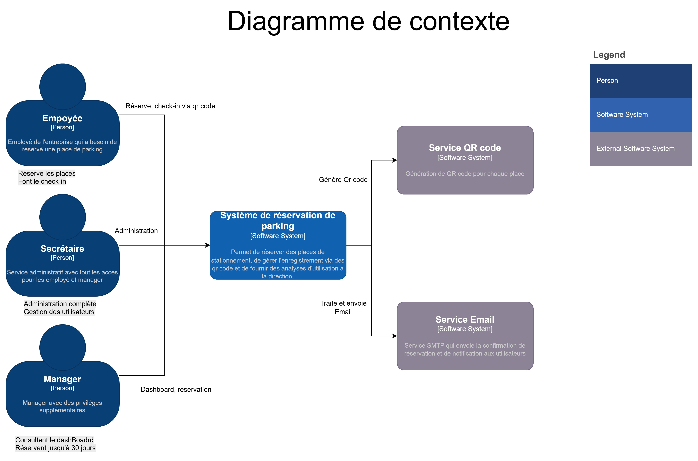
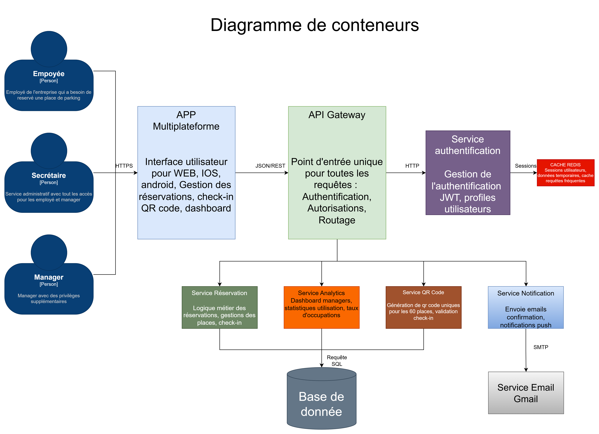

# 📋 Documentation Parking Management System

Repository contenant la documentation technique et architecturale du projet de gestion de parking Flutter + Spring Boot.

## 📁 Contenu du repository

### 📄 Documents
- **[ADRs.pdf](ADRs.pdf)** - Architecture Decision Records détaillant les choix techniques

### 📊 Diagrammes

#### Diagramme de contexte

Présente les acteurs principaux du système :
- **Employés** - Utilisateurs standard
- **Superviseurs** - Gestion des réservations  
- **Managers** - Administration système

#### Diagramme de conteneurs

Architecture technique du système :
- **Flutter Frontend** - Application mobile
- **Spring Boot API Core** - API REST
- **Spring Security Service** - Authentification JWT
- **MySQL Database** - Base de données
- **Email System** - Notifications
- **QR Code Service** - Génération QR codes

#### Diagramme de composants

Vue détaillée des composants internes du système :

Acteurs : Employé, Secrétaire, Manager avec différents niveaux d'accès
Flutter Frontend : Interface utilisateur multiplateforme
Spring Boot API Core : Controllers REST, logique métier, réservations, authentification
Spring Security Service : Authentification JWT et autorisations
Systèmes externes : Email, QR Code Service, Base de données MySQL

## 🏗️ Décisions architecturales

Le fichier [ADRs.md](ADRs.md) documente 6 décisions techniques majeures :

1. **ADR-001** - Application Mobile Flutter (mobile-first)
2. **ADR-002** - Clean Architecture + DDD
3. **ADR-003** - Stack Flutter + Spring Boot + MySQL
4. **ADR-004** - Authentification JWT + Spring Security
5. **ADR-005** - Architecture Modular Monolith
6. **ADR-006** - BLoC Pattern + Repository Pattern

## 📖 Utilisation

Cette documentation sert de référence pour :
- Comprendre l'architecture du système
- Consulter les décisions techniques prises
- Onboarder de nouveaux développeurs
- Maintenir la cohérence architecturale

---

**Note :** Ce repository contient uniquement la documentation. Le code source se trouve dans les repositories séparés frontend et backend.
