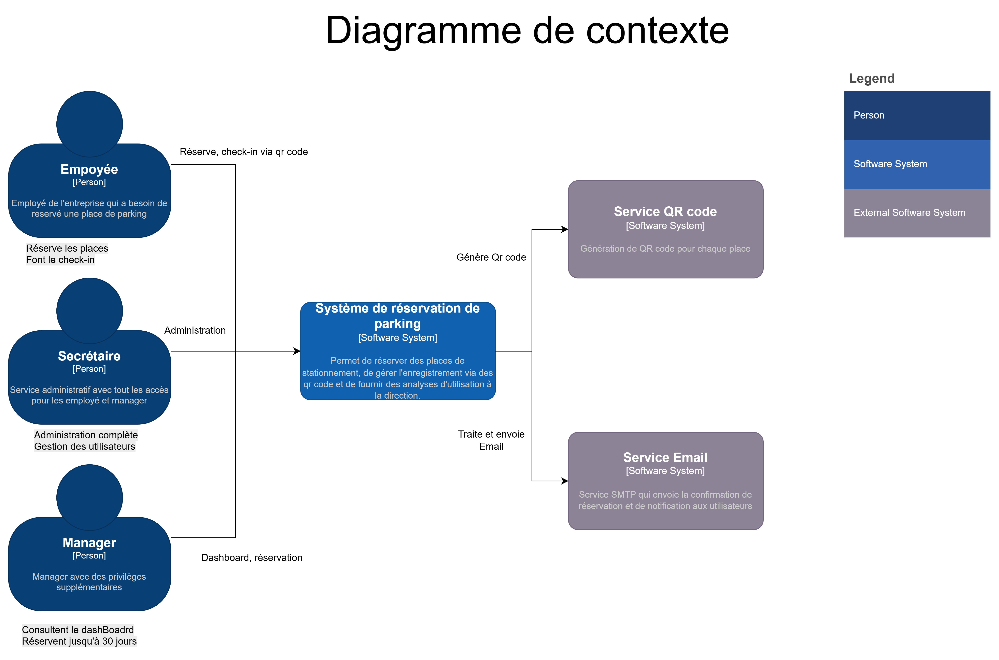
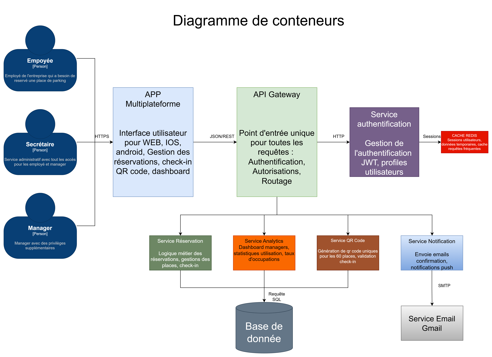
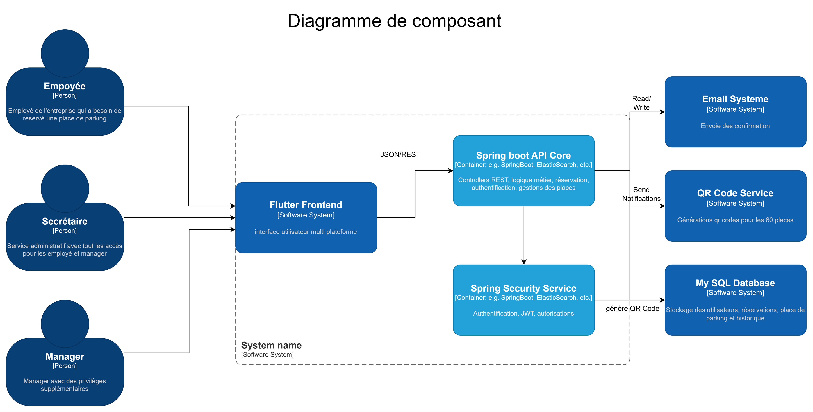

# 📋 Documentation Parking Management System

Repository contenant la documentation technique et architecturale du projet de gestion de parking Flutter + Spring Boot.

## 📁 Contenu du repository

### 📄 Documents
- **[Architecture_Decision_Records](docs/ADRs/)** - Architecture Decision Records détaillant les choix techniques

### 📊 Diagrammes

#### Diagramme de contexte


Présente les acteurs principaux du système :
- **Employés** - Utilisateurs standard
- **Superviseurs** - Gestion des réservations  
- **Managers** - Administration système

#### Diagramme de conteneurs


Architecture technique du système :
- **Flutter Frontend** - Application mobile
- **Spring Boot API Core** - API REST
- **Spring Security Service** - Authentification JWT
- **MySQL Database** - Base de données
- **Email System** - Notifications
- **QR Code Service** - Génération QR codes

#### Diagramme de composants

Vue détaillée des composants internes du système :

Acteurs : Employé, Secrétaire, Manager avec différents niveaux d'accès
Flutter Frontend : Interface utilisateur multiplateforme
Spring Boot API Core : Controllers REST, logique métier, réservations, authentification
Spring Security Service : Authentification JWT et autorisations
Systèmes externes : Email, QR Code Service, Base de données MySQL

## 🏗️ Décisions architecturales

Le dossier [Architecture_Decision_Records](docs/ADRs) documente 11 décisions techniques majeures :

1. **ADR-001** - Application Mobile et Web Flutter
2. **ADR-002** - Clean Architecture + DDD
3. **ADR-003** - Stack Flutter + Spring Boot + MySQL
4. **ADR-004** - Authentification JWT + Spring Security
5. **ADR-005** - Architecture Modular Monolith
6. **ADR-006** - BLoC Pattern + Repository Pattern
7. **ADR-007** - API externe QR Code (60 places A01-F10)
8. **ADR-008** - Containerisation Docker obligatoire
9. **ADR-009** - Stratégie de Tests (JUnit, TestContainers, Flutter)
10. **ADR-010** - Architecture Monolithe Modulaire
11. **ADR-011** - Service QR Code Externe

## 📖 Utilisation

Cette documentation sert de référence pour :
- Comprendre l'architecture du système
- Consulter les décisions techniques prises
- Onboarder de nouveaux développeurs
- Maintenir la cohérence architecturale

---

**Note :** Ce repository contient uniquement la documentation. Le code source se trouve dans les repositories séparés frontend et backend.

## 🚀 Lancement de l'application

### Prérequis
- Docker Desktop installé et démarré

### Commandes

```bash
# 1. Cloner le repository
git clone https://github.com/votre-username/parking-reservation.git
cd parking-reservation

# 2. Lancer l'application complète
docker compose up --build -d

#3. Aller sur l'URL localhost:3000.

 IMPORTANT : Pour des raisons de sécurité, Google Chrome empêche les appels API.
 Il faut l'ouvrir avec cette commande :
 open -n -a /Applications/Google\ Chrome.app/Contents/MacOS/Google\ Chrome --args --user-data-dir="/tmp/chrome-dev" --disable-web-security


IDE : Android Studio
````

## 🔐 Comptes de test 

Après le lancement de l'application, les comptes suivants sont automatiquement créés :

### 👤 Employé
- **Email :** `employee@test.com`
- **Mot de passe :** `password123`
- **Rôle :** Employee 

### 👔 Manager
- **Email :** `manager@test.com`
- **Mot de passe :** `password123`
- **Rôle :** Manager 

### 📋 Secrétaire
- **Email :** `secretary@test.com`
- **Mot de passe :** `password123`
- **Rôle :** Secretary 

## 🧪 Test rapide

1. **Lancer l'application :**
   ```bash
   docker compose up --build -d
   ```
